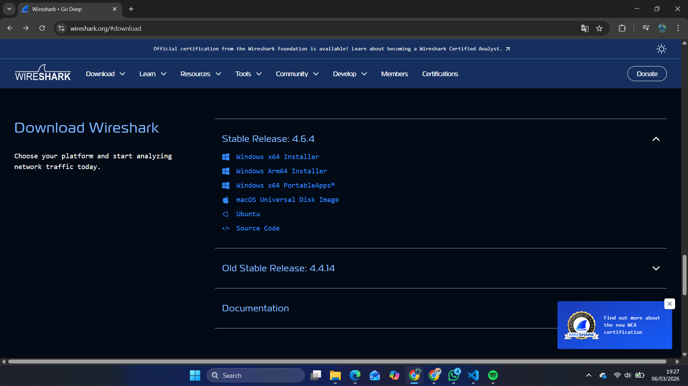
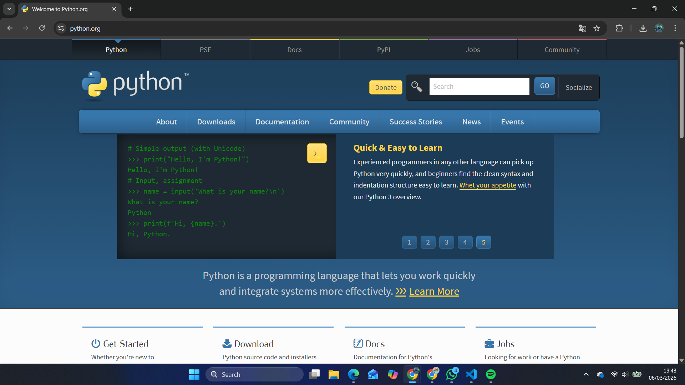
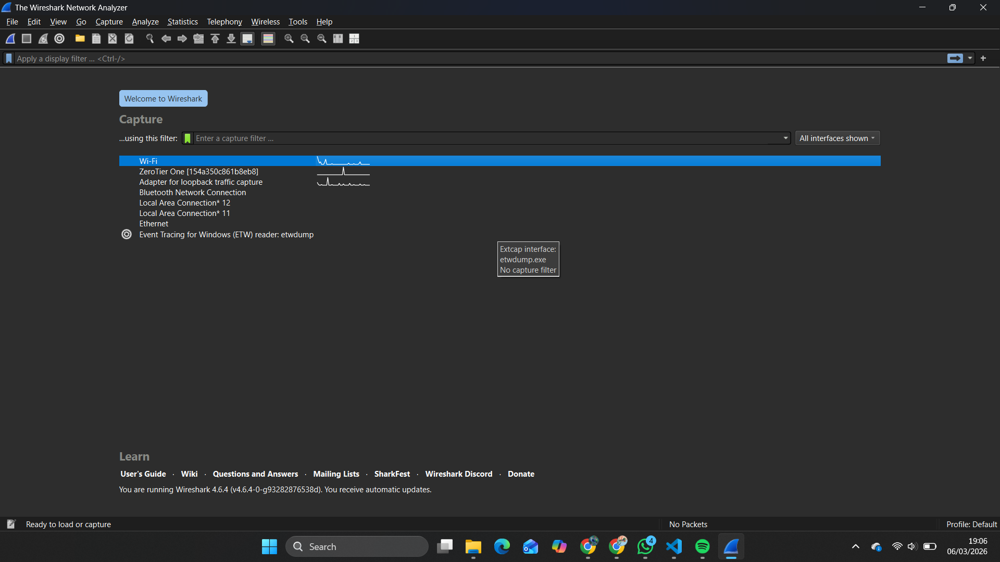
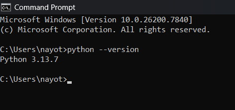
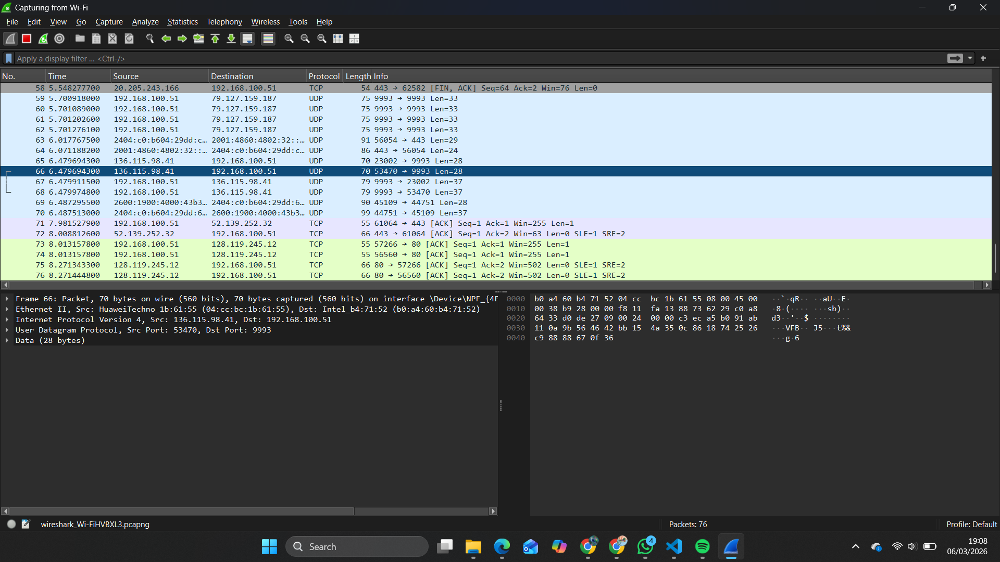
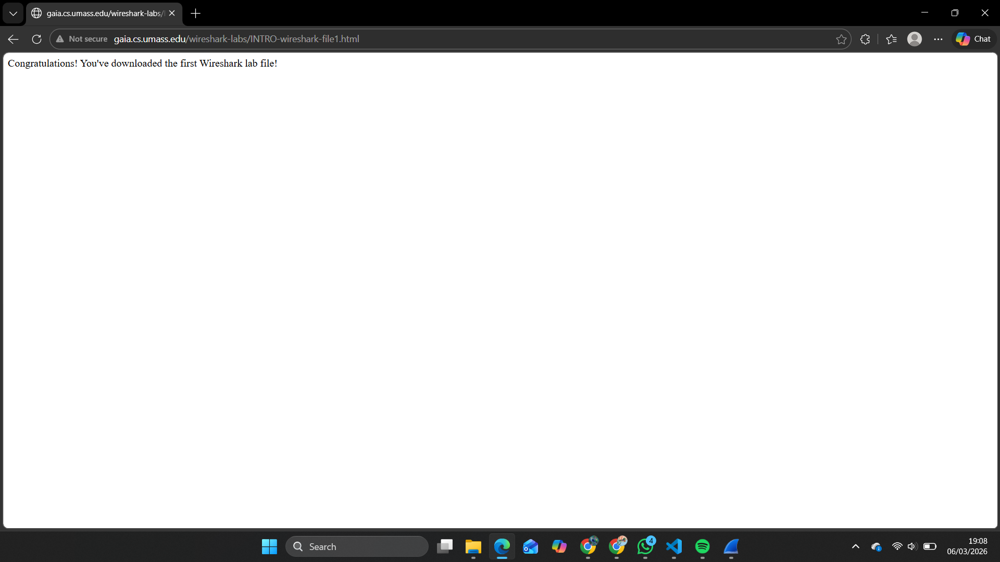
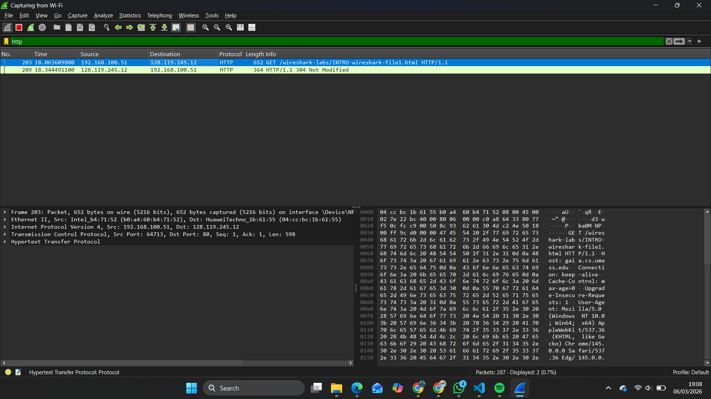

# Laporan Praktikum Jaringan Komputer IF - Week 2

## Test Run WireShark

## Langkah-Langkah Yang Di Lakukan

1. [Instalasi](#instalasi)
2. [Cek Instalasi](#cek-instalasi)
3. [Testing](#testing)

## Instalasi

### WireShark

> WireShark digunakan untuk menganalisis protokol jaringan.



1. Instalasi cukup dilakukan melalui web resmi [wireshark](https://www.wireshark.org/#download).
2. Lalu install installer sesuai dengan OS dari PC/Laptop yang ingin digunakan.
3. Cukup click next lalu install ketika installer dijalankan dan semua yang dibutuhkan wireshark akan terinstall secara otomatis.

### Python

> Python digunakan untuk modul Socket Programming (Modul 7).



1. Instalasi cukup dilakukan melalui web resmi [python](https://www.python.org/).
2. Lalu install installer sesuai dengan OS dari PC/Laptop yang ingin digunakan.
3. Cukup click next lalu install ketika installer dijalankan dan semua yang basic thing dari python akan terinstall secara otomatis.

## Cek Instalasi

> Pastikan telah terinstall.

### Tampilan Awal WireShark



### Cek Instalasi Python



## Testing

> Tahap uji coba wireshark

1. <br/>
Buka wireshark, lalu double click pada capture using **wifi** untuk melakukan analisis melalui jaringan **wifi**. (Pastikan sudah terhubung wifi)

2. <br/>
Setelah melakukan double click pada `capture using wifi`, maka akan muncul tampilan seperti diatas. Kemudian pastikan jika wireshark sudah aktif dengan klik tombol `start capturing packets` pada pojok kiri atas yang memiliki logo sirip hiu berwarna biru.

3. <br/>
Kemudian saat wireshark sedang berjalan, masuklah ke URL: http://gaia.cs.umass.edu/wireshark-labs/INTRO-wireshark-file1.html dan tampilan dari web tersebut akan kurang lebih seperti gambar diatas. Pastikan url menggunakan **http** bukan ~~**https**~~.

4. <br/>
Setelah selesai membuka url tadi, kemudian masuk ke wireshark dan lakukan filter untuk mencari **http**. Kemudian jika berhasil maka akan ada result berupa data dengan protocol `HTTP` dengan info `GET` lalu diikuti dengan nama url.

Setalah semua step dilakukan, kita bisa melihat detail sebagai berikut:

```
1. Informasi fisik tentang paket yang ditangkap (Frame)
2. Informasi alamat MAC client/user dan destination/server (Ethernet II) 
3. Informasi ip dari client/user serta ip destination/server (Internet Protocol Version 4)
4. Informasi port client/user dan destination/server (Transmission Control Protocol)
5. Informasi metode request (GET), host, dan user-agent (Hypertext Transfer Protocol)
```