# Laporan Praktikum Jaringan Komputer IF - Week 3

## Pembahasan Modul 3

> Berikut adalah hal yang dibahas pada praktikum jaringan komputer modul 3

1. [Basic HTTP GET/response interaction](#basic-http-getresponse-interaction)
2. [HTTP CONDITIONAL GET/response interaction](#http-conditional-getresponse-interaction)
3. [Retrieving Long Documents](#retrieving-long-documents)
4. [HTML Documents dengan Embedded Objects](#html-documents-dengan-embedded-objects)
5. [HTTP Authentication](#http-authentication)

## Langkah-Langkah

## Basic HTTP GET/response interaction

> Pada pembahasan ini, kita mengakses web dengan isi HTML sederhana. Wireshark akan menangkap dua pesan utama, yaitu HTTP GET dari user(client) dan HTTP OK dari server.

1. Bersihkan cache browser.<br>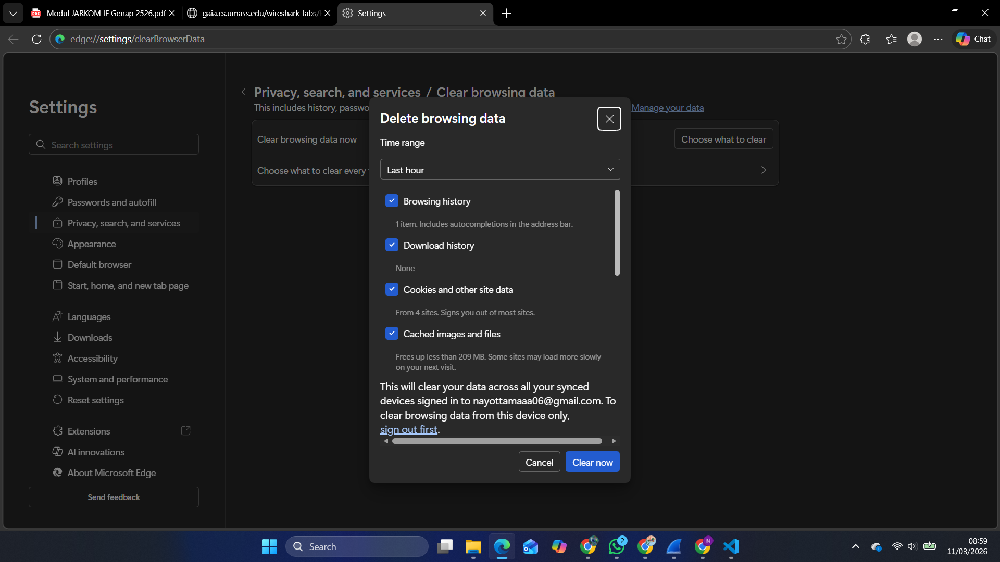
2. Jalankan wireshark dan lakukan filter untuk protocol `HTTP`.<br>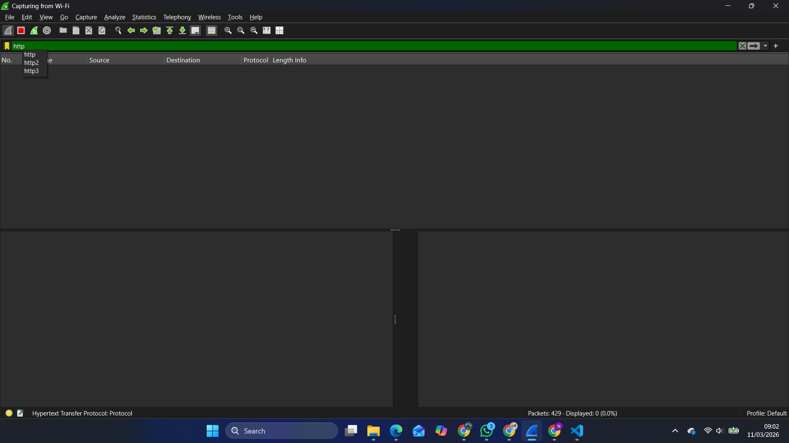
3. Akses URL: http://gaia.cs.umass.edu/wireshark-labs/HTTP-wireshark-file1.html dan pastikan url menggunakan **http** bukan ~~**https**~~.<br>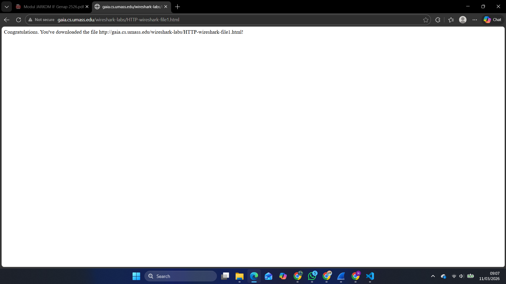
4. Setelah itu masuk ke wireshark dan hentikan proses capture.<br>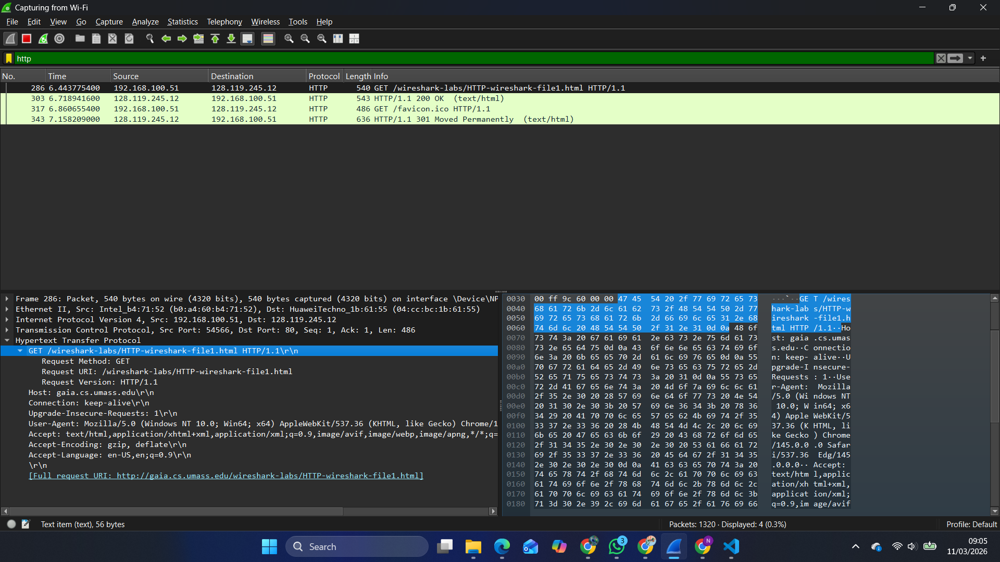<br>Dapat dilihat pada baris pertama berhasil melaksanakan method GET pada /wireshark-labs/HTTP-wireshark-file1.html

```
Hasil Analisis Basic HTTP GET/Response Interaction:
1. Request Method: GET
2. Host: gaia.cs.umass.edu, Destination: 128.119.245.12
3. Status Code: 200
4. Response Phrase: OK
5. Content-Type: text/html
```

## HTTP CONDITIONAL GET/response interaction

> Pada pembahasan ini, web diakses dua kali dengan akses kedua yang memanfaatkan cache browser.

1. Bersihkan cache browser.<br>
2. Jalankan wireshark dan lakukan filter untuk protocol `HTTP`.<br>
3. Akses URL: http://gaia.cs.umass.edu/wireshark-labs/HTTP-wireshark-file2.html dan pastikan url menggunakan **http** bukan ~~**https**~~.<br>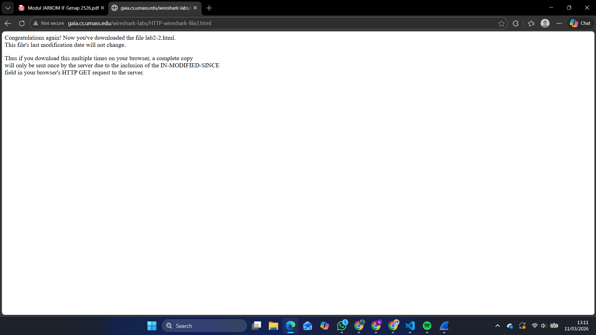
4. Lakukan refresh pada halaman web atau masuk kembali ke url yang sama di browser. Kemudian masuk ke wireshark dan hasil akhirnya akan seperti berikut ini.<br>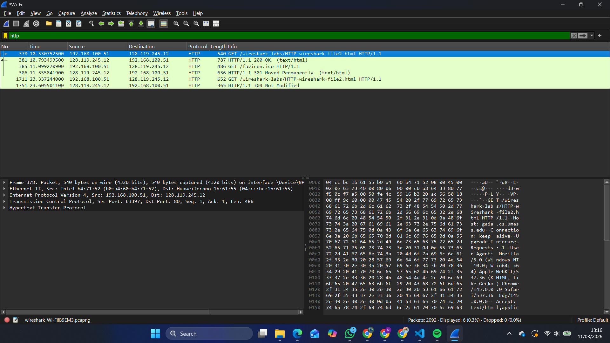

```
Hasil Analisis HTTP CONDITIONAL GET/Response Interaction:
1. Pada request kedua, muncul header If-Modified-Since yang menandakan kapan browser terakhir kali menyimpan resource di cache(berada di no 1711 pada gambar saya)
2. Server merespon request dengan status Code 304, yang berarti client cached masih valid dan tidak perlu melakukan download ulang resource dari server. Hal ini menghemat bandwidth.
```

## Retrieving Long Documents

> Mengakses "Bill of Rights AS" yang cukup panjang (sekitar 4500 byte).

1. Bersihkan cache browser.<br>
2. Jalankan wireshark dan lakukan filter untuk protocol `HTTP`.<br>
3. Akses URL: http://gaia.cs.umass.edu/wireshark-labs/HTTP-wireshark-file3.html dan pastikan url menggunakan **http** bukan ~~**https**~~.<br>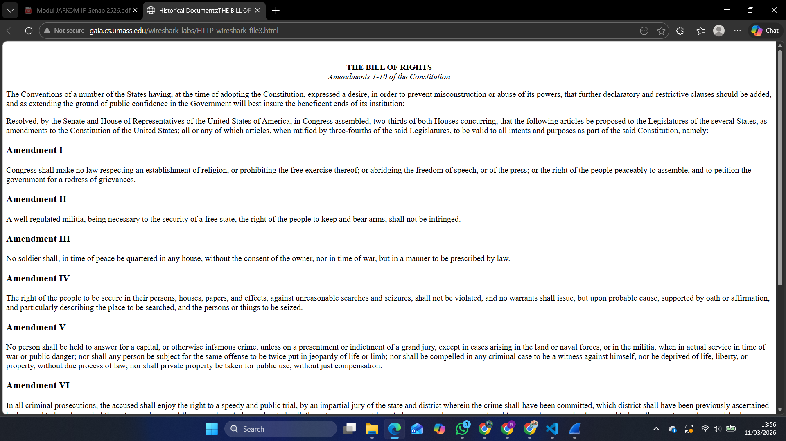
4. Masuk ke dalam wireshark dan hentikan proses capture<br>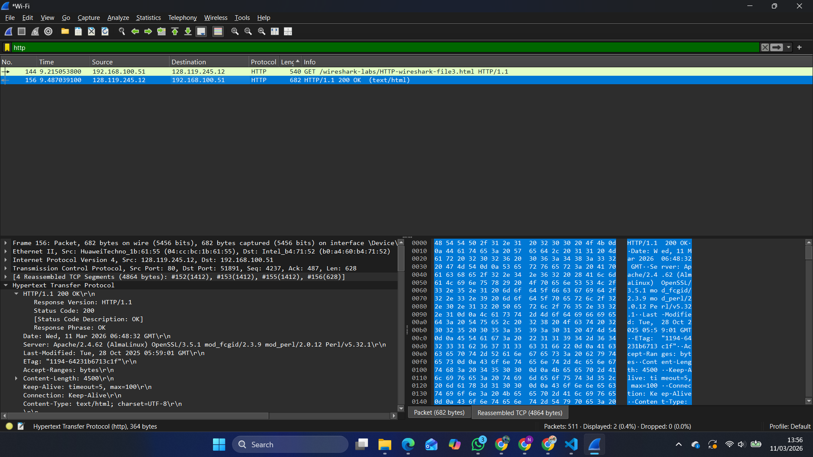

```
Hasil Analisis Retrieving Long Documents:
Respons HTTP tidak muat dalam satu paket TCP. Wireshark menampilkan keterangan Reassemble TCP Segment pada HTTP/1.1 OK yang menunjukkan bahwa TCP memecah data besar menjadi segmen-segmen kecil sebelum dikirim.
```

## HTML Documents dengan Embedded Objects

> Mengakses halaman HTML yang mengandung 2 gambar yang disimpan di server berbeda.

1. Bersihkan cache browser.<br>
2. Jalankan wireshark dan lakukan filter untuk protocol `HTTP`.<br>
3. Akses URL: http://gaia.cs.umass.edu/wireshark-labs/HTTP-wireshark-file4.html dan pastikan url menggunakan **http** bukan ~~**https**~~.<br>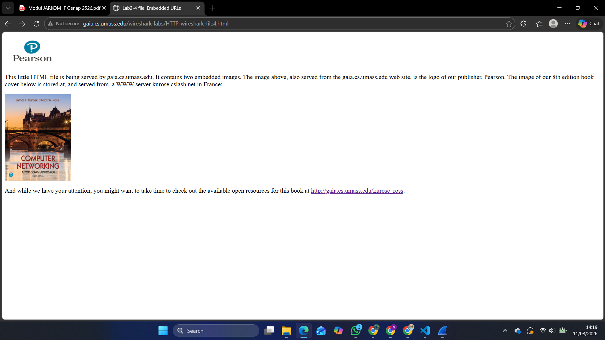
4. Masuk ke dalam wireshark dan hentikan proses capture<br>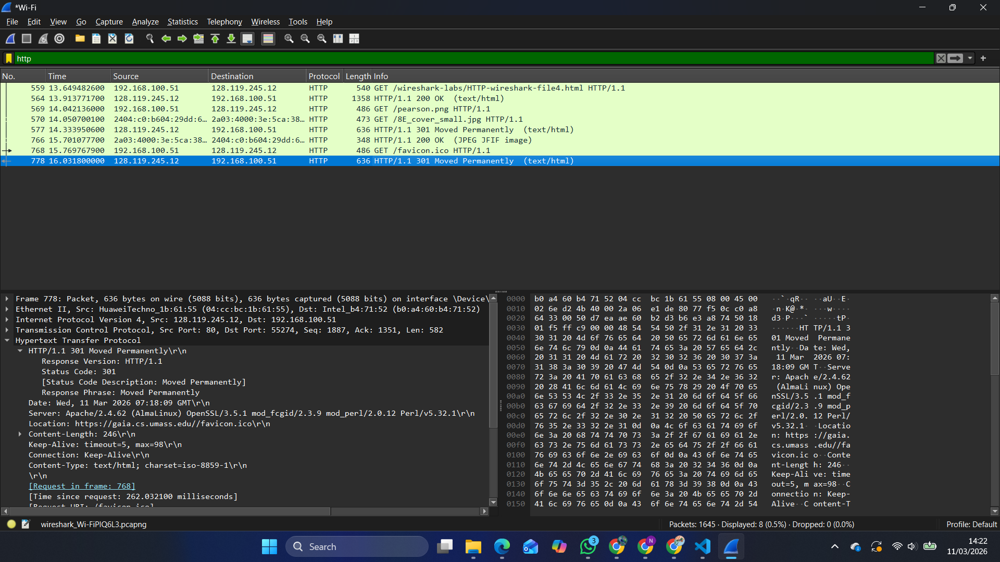

```
Hasil Analisis HTML Documents dengan Embedded Objects:
Terdapat lebih dari 1 request method GET, karena GET pertama untuk file HTML utama sedangkan GET tambahannya untuk objek gambar yang direferensikan.
```

## HTTP Authentication

> Mengakses halaman yang dilindungi password.

1. Bersihkan cache browser.<br>
2. Jalankan wireshark dan lakukan filter untuk protocol `HTTP`.<br>
3. Akses URL: http://gaia.cs.umass.edu/wireshark-labs/HTTP-wireshark-file5.html dan pastikan url menggunakan **http** bukan ~~**https**~~. Kemudian masukkan username `wireshark-students` dan password `network`. Tampilannya akan menjadi seperti ini. <br>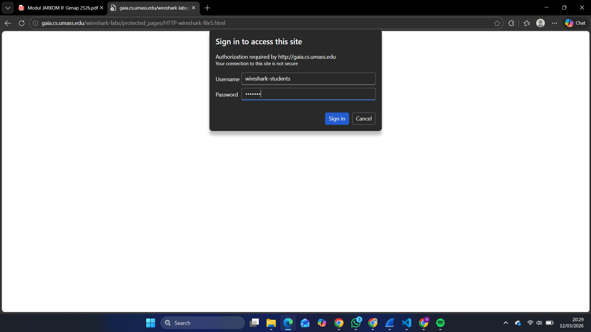<br>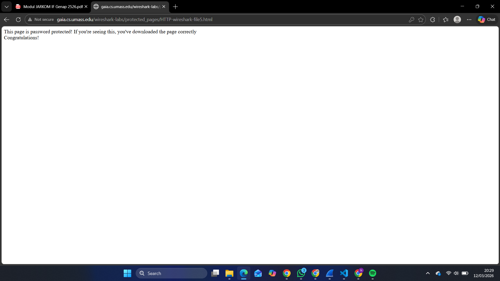
4. Masuk ke dalam wireshark dan hentikan proses capture.<br>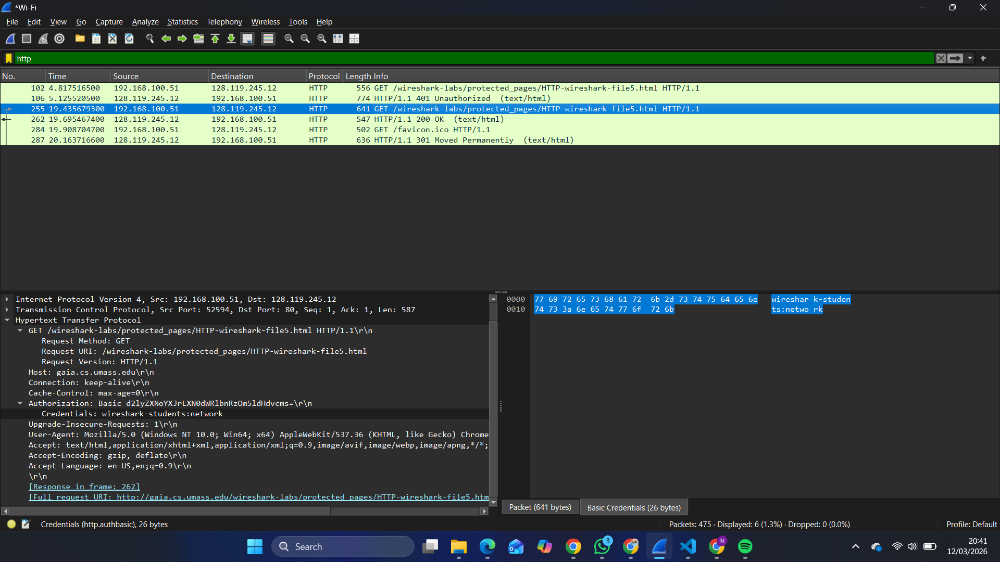

```
Hasil Analisis HTTP Authentication:
1. Pada request pertama, server menolak client dengan status 401 unauthorized. 401 unauthorized adalah indikasi server menolak request karena auth yang invalid, missing, ataupun expired.
2. Pada request kedua, client mengirim ulang GET dengan header authorization basic yang di mana credentials dikirimkan dalam bentuk teks yang hanya di-encode menggunakan base64.
3. Karena base64 bukan enkripsi, maka siapa saja dapat mendecode username dan password menggunakan decoder base64 online. Hal ini menunjukkan bahwa HTTP basic auth tidak aman tanpa HTTPS.
```