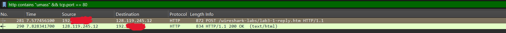
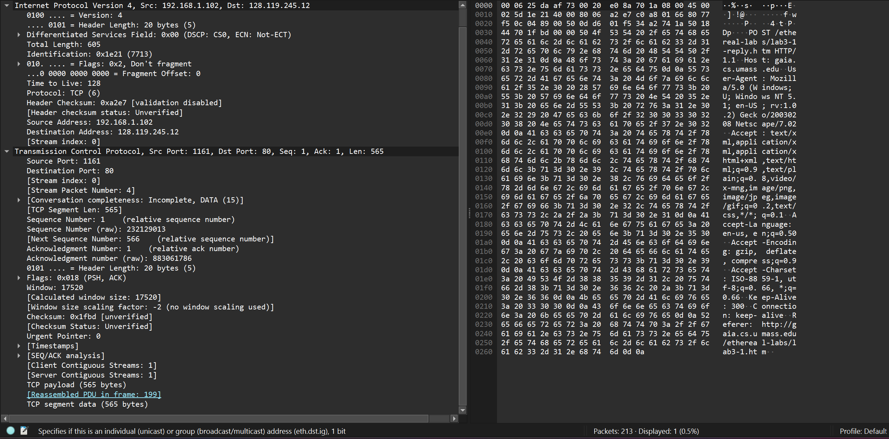
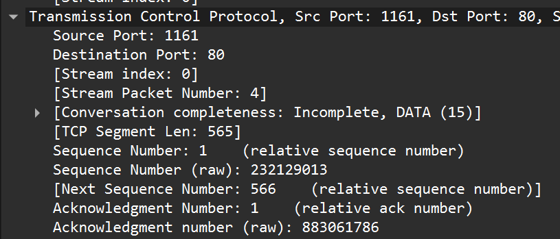
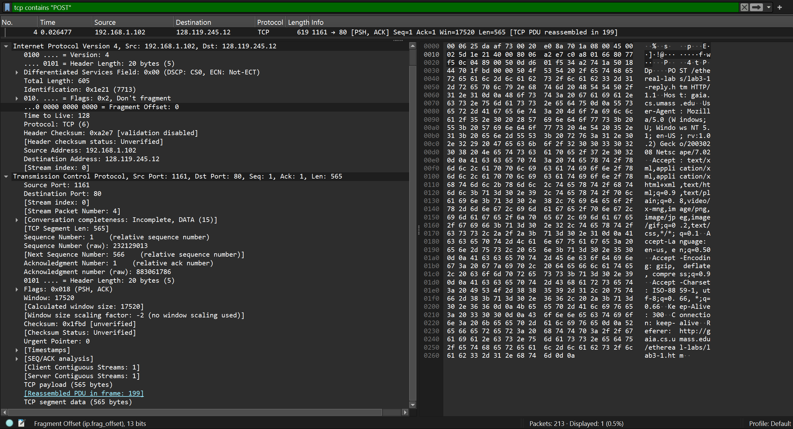
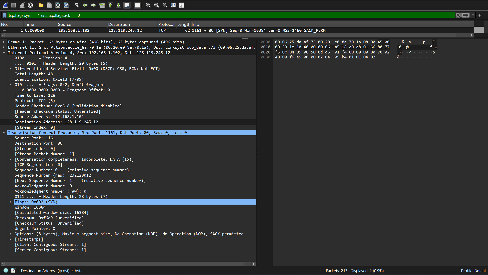
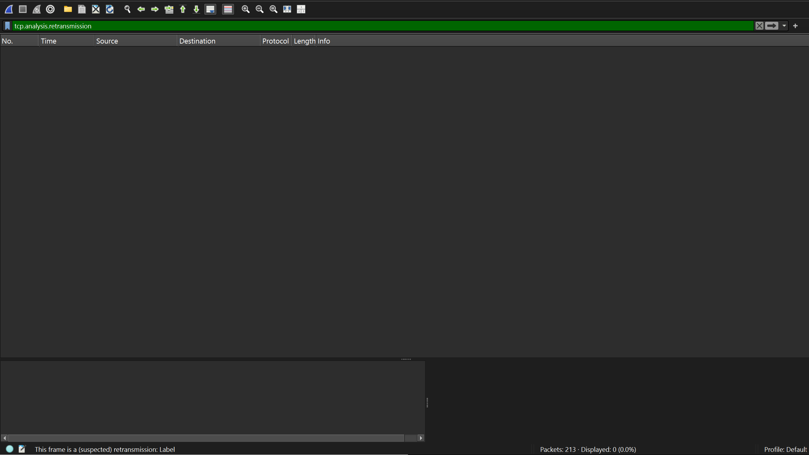
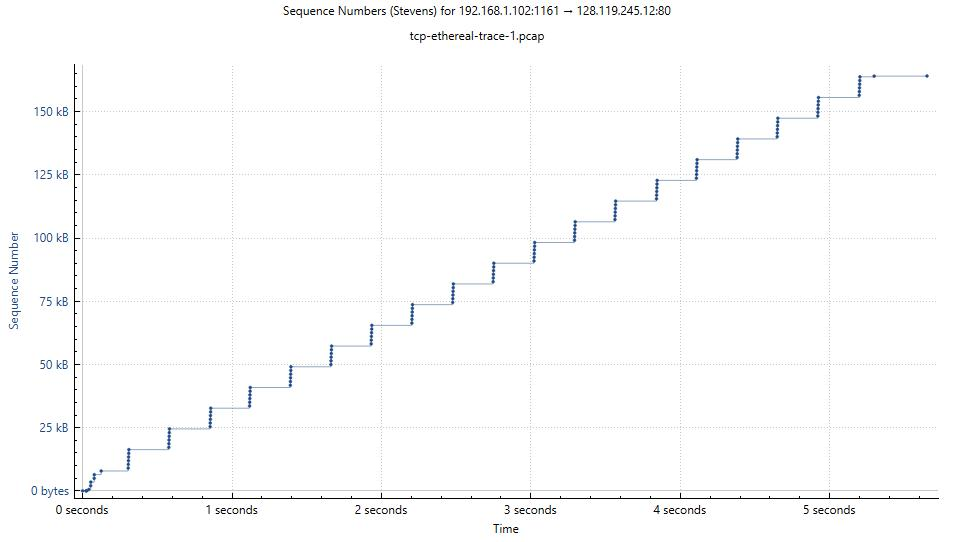

# Laporan Praktikum Jaringan Komputer IF - Week 5

## Tugas Modul 6

> Berikut adalah hal yang dikerjakan pada praktikum jaringan komputer modul 6

1. [6.3 Tampilan Awal pada Capture Trace](#soal-dan-jawaban-63-tampilan-awal-pada-capture-trace)
2. [6.4 Dasar TCP](#soal-dan-jawaban-64-dasar-tcp)
3. [6.5 Congestion Control pada TCP](#soal-dan-jawaban-65-congestion-control-pada-tcp)

## Soal dan Jawaban 6.3 Tampilan Awal pada Capture Trace

> Soal

1. Berapa alamat IP dan nomor port TCP yang digunakan oleh komputer klien (sumber) untuk mentransfer file ke gaia.cs.umass.edu? Cara paling mudah menjawab pertanyaan ini adalah dengan memilih sebuah pesan HTTP dan meneliti detail paket TCP yang digunakan untuk membawa pesan HTTP tersebut. 

2. Apa alamat IP dari gaia.cs.umass.edu? Pada nomor port berapa ia mengirim dan menerima segmen TCP untuk koneksi ini?

3. Berapa alamat IP dan nomor port TCP yang digunakan oleh komputer klien Anda (sumber) untuk mentransfer  ke gaia.cs.umass.edu?

> Jawaban

1. Alamat IP Client: 192.168.1.102 Port Client: 1161

2. Alamat IP Server: 128.119.245.12 Port Server: 80

3. Alamat IP Client: 192.168.1.102 Port Client: 1161

> Bukti

## Soal dan Jawaban 6.4 Dasar TCP

> Soal

1. Berapa nomor urut segmen TCP SYN yang digunakan untuk memulai sambungan TCP antara komputer klien dan gaia.cs.umass.edu? Apa yang dimiliki segmen tersebut sehingga teridentifikasi sebagai segmen SYN?

2. Berapa nomor urut segmen SYNACK yang dikirim oleh gaia.cs.umass.edu ke komputer klien sebagai balasan dari SYN? Berapa nilai dari field Acknowledgement pada segmen SYNACK? Bagaimana gaia.cs.umass.edu menentukan nilai tersebut? Apa yang dimiliki oleh segmen sehingga teridentifikasi sebagai segmen SYNACK?

3. Berapa nomor urut segmen TCP yang berisi perintah HTTP POST? Perhatikan bahwa untuk menemukan perintah POST, Anda harus menelusuri content field milik paket di bagian bawah jendela Wireshark, kemudian cari segmen yang berisi "POST" di bagian field DATAnya.

4. Anggap segmen TCP yang berisi HTTP POST sebagai segmen pertama dalam koneksi TCP. Berapa nomor urut dari enam segmen pertama dalam TCP (termasuk segmen yang berisi HTTP POST)? Pada jam berapa setiap segmen dikirim? Kapan ACK untuk setiap segmen diterima? Dengan adanya perbedaan antara kapan setiap segmen TCP dikirim dan kapan acknowledgement-nya diterima, berapakah nilai RTT untuk keenam segmen tersebut? Berapa nilai Estimated RTT setelah penerimaan setiap ACK? (Catatan: Wireshark memiliki fitur yang memungkinkan Anda untuk memplot RTT untuk setiap segmen TCP yang dikirim. Pilih segmen TCP yang dikirim dari klien ke server gaia.cs.umass.edu pada jendela "paket yang ditangkap". Kemudian pilih: Statistics->TCP Stream Graph- >Round Trip Time Graph).

5. Berapa panjang setiap enam segmen TCP pertama?

6. Berapa jumlah minimum ruang buffer tersedia yang disarankan kepada penerima dan diterima untuk seluruh trace? Apakah kurangnya ruang buffer penerima pernah menghambat pengiriman?

7. Apakah ada segmen yang ditransmisikan ulang dalam file trace? Apa yang anda periksa (di dalam file trace) untuk menjawab pertanyaan ini?

8. Berapa banyak data yang biasanya diakui oleh penerima dalam ACK? Dapatkah anda mengidentifikasi kasus-kasus di mana penerima melakukan ACK untuk setiap segmen yang diterima?

9. Berapa throughput (byte yang ditransfer per satuan waktu) untuk sambungan TCP? Jelaskan bagaimana Anda menghitung nilai ini.

> Jawaban

1. a. Sequence Number (Client → Server) = 0 (relative) b. Segment tersebut adalah SYN karena hex pada flags 0x002. (SYN = 1, ACK = 0)

2. a. Sequence Number (Server → Client) = 0 (relative) b. Field acknowledgement = 1 c. Cara menentukan: server ambil seq SYN client lalu tambah 1 d. Ciri SYN-ACK: SYN = 1 && ACK = 1

3. Sequence Number (relative): 1 Sequence Number (raw): 232129013 

4. **Segmen 1 (Frame 199, HTTP POST)** Sequence Number: 164041 Ack: 1 Waktu kirim: 5.297341 detik ACK diterima di Frame 201 pada 5.447887 detik RTT ≈ 0.150 detik  **Segmen 2 (Frame 200)** Sequence Number: 1 Ack: 232291321 Waktu kirim: 5.389471 detik  **Segmen 3 (Frame 201)** Sequence Number: 1 Ack: 164041 Waktu kirim: 5.447887 detik  **Segmen 4 (Frame 202)** Sequence Number: 1 Ack: 164091 Waktu kirim: 5.455830 detik  **Segmen 5 (Frame 203)** Sequence Number: 1 Ack: 164091 Waktu kirim: 5.461175 detik  **Segmen 6 (Frame 206)** Sequence Number: 164091 Ack: 731 Waktu kirim: 5.651141 detik  Note: a. RTT untuk segmen selain pertama dihitung dengan cara sama, yaitu selisih waktu pengiriman dan waktu ACK diterima. b. Estimated RTT juga dapat dilihat di Wireshark: Statistics → TCP Stream Graph → Round Trip Time Graph. c. Semua sequence dan acknowledgment menggunakan relative numbers.

5. Panjang setiap segmen Segmen 199 (HTTP POST): 104 bytes Segmen 200: 60 bytes Segmen 201: 60 bytes Segmen 202: 60 bytes Segmen 203: 784 bytes Segmen 206: 54 bytes

6. Berdasarkan hasil analisis trace pada Wireshark, nilai window size TCP tidak pernah mencapai 0 yang artinya tidak terdapat hambatan karena buffer.

7. Tidak ada segmen yang muncul lebih dari sekali

8. Data yang diakui oleh penerima a. Pada umumnya, penerima akan mengirimkan ACK untuk seluruh data yang telah berhasil diterima hingga titik tertentu. b. Berdasarkan trace, nilai ACK biasanya bertambah sesuai dengan ukuran data yang diterima (ex: jika satu segmen membawa 60 byte, maka nilai ACK akan meningkat sebesar 60). c. Terdapat kondisi tertentu di mana penerima tidak langsung mengirim ACK untuk setiap segmen. Dalam kasus seperti ini, satu ACK dapat mengakui beberapa segmen sekaligus apabila segmen-segmen sebelumnya sudah diterima dengan baik (cumulative ACK).

9. Throughput = total byte yang dikirim / total waktu koneksi. Contoh dari trace: &emsp;Total data: jumlah TCP segment length dari segmen POST + segmen lainnya → 104 + 60 + 60 + 60 + 784 + 54 = 1122 bytes &emsp;Total waktu: selisih antara paket pertama dan terakhir → 5.651141 s − 5.297341 s ≈ 0.354 s &emsp;Throughput ≈ 1122 / 0.354 ≈ 3168 bytes/s (~3.1 KB/s) Bisa dilihat di Wireshark: Statistics → TCP Stream Graph → Throughput

> Bukti

## Soal dan Jawaban 6.5 Congestion Control pada TCP

> Soal

1. Gunakan alat plotting Time-Sequence-Graph (Stevens) untuk melihat grafik nomor urut berbanding waktu dari segmen yang dikirim oleh klien ke server gaia.cs.umass.edu. Dapatkah Anda mengidentifikasi di mana fase “slow start” TCP dimulai dan berakhir, dan pada bagian mana algoritma ”congestion avoidance” mengambil alih? Berikan komentar tentang bagaimana data yang diukur berbeda dari perilaku ideal TCP yang telah kita pelajari. 

2. Jawablah kedua pertanyaan di atas untuk trace yang Anda dapatkan ketika Anda mengirimkan file dari komputer ke gaia.cs.umass.edu.

> Jawaban

1. Time-Sequence-Graph (Stevens) **Fase slow start** dimulai sejak awal pengiriman data, terlihat dari peningkatan sequence number yang sangat cepat. Pada grafik, bagian ini tampak lebih curam dibandingkan bagian selanjutnya. **Akhir slow start** dapat dikenali saat kemiringan grafik mulai menurun, biasanya terjadi sekitar detik 0.5–1. Setelah itu, kenaikan sequence number tidak lagi secepat di awal. **Fase congestion avoidance** dimulai setelah transisi tersebut, ditandai dengan pertambahan sequence number yang lebih stabil dan cenderung linear terhadap waktu. **Perbedaan dengan TCP ideal:** secara teori, kurva slow start berbentuk eksponensial halus lalu berubah menjadi linear. Namun pada data nyata, grafik terlihat bertahap (tidak mulus) karena pengiriman paket bergantung pada penerimaan ACK, serta adanya jeda antar segmen yang membuat pola tidak seideal model teori.

2. Done

> Bukti

