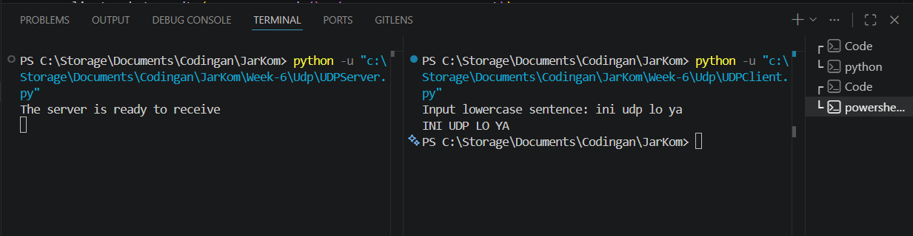
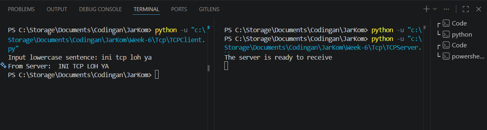

# Laporan Praktikum Jaringan Komputer IF - Week 6

## Tugas Modul 7

## Source Code

> UDP

[UDP Client](../Week-6/Udp/UDPClient.py)

[UDP Server](../Week-6/Udp/UDPServer.py)

> TCP

[TCP Client](../Week-6/Tcp/TCPClient.py)

[TCP Server](../Week-6/Tcp/TCPServer.py)

## Cara Running

1. **Run Server**
    
    UDP:
    ```
    python UDPServer.py
    ```
    TCP:  
    ```
    python TCPServer.py
    ```

2. **Run Client**
    
    UDP:  
    ```
    python UDPClient.py
    ```
    TCP:  
    ```
    python TCPClient.py
    ```

3. **Input**
    
    UDP: ini udp loh ya
    <br>TCP: ini tcp loh ya

## Implementasi UDP

### Konsep
- Tidak menjamin data sampai
- Tidak perlu koneksi
- Mengirim data langsung

### Alur Program
1. Client input teks
2. Client kirim ke server
3. Server terima data
4. Server ubah ke huruf besar
5. Server kirim balik

### Potongan Kode Client
```
clientSocket = socket(AF_INET, SOCK_DGRAM)
clientSocket.sendto(message.encode(), (serverName, serverPort))
```

### Potongan Kode Server
```
message, clientAddress = serverSocket.recvfrom(2048)
modifiedMessage = message.decode().upper()
serverSocket.sendto(modifiedMessage.encode(), clientAddress)
```

## Implementasi TCP

### Konsep
- Harus membuat koneksi
- Urutan data terjamin
- Data lebih aman

### Alur Program
1. Client connect ke server
2. Server menerima koneksi
3. Client kirim data
4. Server proses data
5. Server kirim balik

### Potongan Kode Client
```
clientSocket = socket(AF_INET, SOCK_STREAM)
clientSocket.connect((serverName, serverPort))
clientSocket.send(sentence.encode())
```

### Potongan Kode Server
```
serverSocket.listen(1)
connectionSocket, addr = serverSocket.accept()
sentence = connectionSocket.recv(1024).decode()
```

## Perbedaan UDP dan TCP

| Aspek | UDP | TCP |
|:---:|:---:|:---:|
| Kecepatan | Lebih cepat | Lebih lambat |
| Koneksi | Tidak ada | Ada (handshake) |
| Urutan data | Tidak dijamin | Teratur |
| Jaminan data sampai | Tidak dijamin | Dijamin |

## Contoh Input Output

> UDP



> TCP

